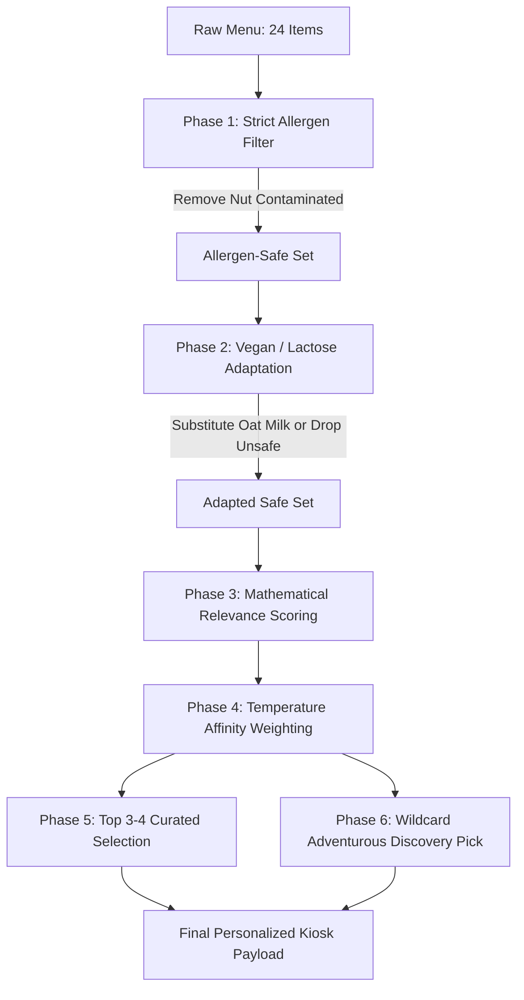

# Phase 1 Detailed Blueprint & Execution Plan
### Mock Data Layer, Personalization Engine & State Architecture

---

## 🎯 Phase 1 Objective

Phase 1 constructs the intelligent core of **Fayrouz (فيروز)**. It establishes:
1. A rich, specialty-grade dataset of **24+ authentic items** spanning 5 distinct categories, featuring English and Arabic nomenclature, precise roast and sweetness profiles, allergen metadata, and Levantine storytelling.
2. A deterministic, multi-variable **Personalization & Relevance Engine** (`personalizationEngine.js`) executing strict allergen guardrails, plant-based substitutions, palate scoring distance mathematics, temperature affinity, and a dynamic **Adventurous Wildcard ("Expand Your Palate")** algorithm with bespoke narrative explanations.
3. A centralized **State Management Architecture** (`ProfileContext.jsx`) synchronizing user taste profiles, wizard progression, multi-device viewport modes, and simulated NFC kiosk pairing.
4. An interactive **Engine Testbench & Verification Suite** to empirically validate all filtering, ranking, and edge-case permutations before building UI components in Phase 2.

---

## 🧠 Architectural & Algorithmic Design ("Ultrathink")

### 1. Data Contract: `MenuItem` Schema

To satisfy both the upcoming Mobile Wizard (Phase 2) and the Tablet Kiosk (Phase 3), each item in `src/data/menuData.json` must be rich with sensory and dietary metadata:

```typescript
interface MenuItem {
  id: string;                         // e.g. "damascus-rose-cortado"
  name: string;                       // "Damascus Rose Cortado"
  nameAr: string;                     // "كورتادو الورد الدمشقي"
  category: string;                   // "espresso-black" | "velvet-milk" | "cold-brew" | "levantine-signature" | "tea-botanical"
  categoryName: string;               // English display category
  categoryNameAr: string;             // Arabic display category
  description: string;                // Specialty sensory description
  descriptionAr: string;              // Arabic sensory description
  price: number;                      // e.g. 5.75 (USD)
  
  // Palate & Sensory Scoring
  profileScore: number;               // 1 to 10 (1 = Intense Dark/Acidic, 10 = Sweet Dessert/Creamy)
  sweetness: number;                  // 1 to 5 (visual gauge)
  intensity: number;                  // 1 to 5 (body & roast boldness)
  acidity: number;                    // 1 to 5 (bright fruit vs deep cocoa)
  body: "Light & Silky" | "Velvety" | "Full & Heavy" | "Effervescent";
  roastLevel: "Light" | "Medium-Light" | "Medium" | "Dark";
  
  // Temperature Support
  canBeHot: boolean;
  canBeIced: boolean;
  defaultTemperature: "hot" | "iced";

  // Dietary & Allergen Metadata
  containsDairy: boolean;
  dairyAlternative: string | null;    // e.g. "Oat Milk" (if adaptable)
  containsNuts: boolean;              // Pistachio, Almond, Walnut
  nutType?: string;                   // "Aleppo Pistachio", "Roasted Walnut", etc.
  isVegan: boolean;                   // Naturally vegan
  canBeVegan: boolean;                // Can be made vegan with Oat Milk substitution
  containsGluten: boolean;            // For pastry/specialty infusions
  caffeineLevel: "High" | "Medium" | "Low" | "Decaf" | "None";

  // Storytelling & Visual Highlights
  tastingNotes: string[];             // e.g. ["Damascene Rose", "Green Cardamom", "Cacao Nibs"]
  badge?: "Signature Pick" | "Barista Favorite" | "Single Origin" | "Wildcraft Seasonal";
  story: string;                      // Cultural narrative (Fayrouziyat warmth)
  calories: number;                   // Transparency metric
}
```

---

### 2. The 24-Item Specialty Catalog Taxonomy

The menu spans five curated categories balancing purist coffee, milky comfort, Levantine heritage, and modern botanical drinks:

```
┌───────────────────────────┬──────┬──────────────┬────────┬────────┬───────┐
│ Item Name                 │ Cat  │ Profile (1-10)│ Temp   │ Dairy? │ Nuts? │
├───────────────────────────┼──────┼──────────────┼────────┼────────┼───────┤
│ 1. Sidama Double Espresso │ ESP  │ 1 (Bold/Acid)│ Hot    │ No     │ No    │
│ 2. Single-Origin Americano│ ESP  │ 2 (Crisp)    │ Both   │ No     │ No    │
│ 3. Panama Geisha Pour-Over│ ESP  │ 3 (Floral)   │ Hot    │ No     │ No    │
│ 4. Kyoto Slow-Drip Cold   │ ESP  │ 2 (Deep)     │ Iced   │ No     │ No    │
│ 5. Classic Oat Flat White │ VEL  │ 5 (Balanced) │ Both   │ Oat    │ No    │
│ 6. Velvet Spanish Latte   │ VEL  │ 9 (Sweet)    │ Both   │ Yes*   │ No    │
│ 7. Salted Date Macchiato  │ VEL  │ 8 (Rich)     │ Both   │ Yes*   │ No    │
│ 8. Aleppo Pistachio Latte │ VEL  │ 9 (Nutty)    │ Both   │ Yes*   │ YES 🥜│
│ 9. Golden Turmeric Bloom  │ VEL  │ 6 (Spiced)   │ Both   │ Oat    │ No    │
│ 10. Vanilla Cardamom Miel │ VEL  │ 8 (Creamy)   │ Both   │ Yes*   │ No    │
│ 11. Cascara Sparkling Tonic│ CB   │ 3 (Fizzy/Tart│ Iced   │ No     │ No    │
│ 12. Smoked Date Nitro Cold│ CB   │ 6 (Smooth)   │ Iced   │ No     │ No    │
│ 13. Coconut Cold Foam Brew│ CB   │ 7 (Velvety)  │ Iced   │ No     │ No    │
│ 14. Citrus Blossom Cold Br│ CB   │ 4 (Zesty)    │ Iced   │ No     │ No    │
│ 15. Traditional Rakwa     │ LEV  │ 2 (Cardamom) │ Hot    │ No     │ No    │
│ 16. Damascus Rose Cortado │ LEV  │ 5 (Floral)   │ Both   │ Yes*   │ No    │
│ 17. Orange Blossom Shaker │ LEV  │ 4 (Silky)    │ Iced   │ No     │ No    │
│ 18. Tahini Dark Chocolate │ LEV  │ 7 (Earthy)   │ Both   │ Yes*   │ No    │
│ 19. Baklava Spiced Latte  │ LEV  │ 9 (Decadent) │ Both   │ Yes*   │ YES 🥜│
│ 20. Mastic Espresso Tonic │ LEV  │ 3 (Resinous) │ Iced   │ No     │ No    │
│ 21. Wild Sage & Thyme Tis │ TEA  │ 2 (Herbal)   │ Hot    │ No     │ No    │
│ 22. Damascene Rose Petal  │ TEA  │ 4 (Delicate) │ Hot    │ No     │ No    │
│ 23. Ceremonial Matcha Oat │ TEA  │ 6 (Umami)    │ Both   │ Oat    │ No    │
│ 24. Hibiscus Cashew Cloud │ TEA  │ 7 (Fruity)   │ Iced   │ No     │ YES 🥜│
└───────────────────────────┴──────┴──────────────┴────────┴────────┴───────┘
*Yes*: Default contains dairy, but has plant-based oat substitution.
```

---

### 3. Personalization Engine Mathematical Logic (`personalizationEngine.js`)

#### A. Pipeline Execution Architecture



#### B. Step 1: Strict Allergen & Dietary Rules (Safety Gate)

1. **Nut Allergy (`nut-free` / `nut-allergy`)**:
   - If `profile.dietary.includes('nut-free')`:
     - If `item.containsNuts === true`: **DROP completely** (status: `EXCLUDED_ALLERGEN`). Unsafe to consume.
2. **100% Vegan (`vegan`)**:
   - If `profile.dietary.includes('vegan')`:
     - If `item.isVegan === true`: **KEEP** (`dietaryStatus: 'naturally-vegan'`).
     - If `item.isVegan === false && item.canBeVegan === true`: **ADAPT**:
       - Set `adapted: true`
       - Set `appliedMilk: "Oat Milk"`
       - Set `displayPrice = item.price` (complimentary specialty plant milk)
       - Set `badgeNotice: "Auto-Swapped to Oat Milk"`
     - If `item.isVegan === false && item.canBeVegan === false`: **DROP** (`EXCLUDED_NON_VEGAN`).
3. **Lactose Intolerance (`lactose-free`)**:
   - If `profile.dietary.includes('lactose-free')` and not vegan:
     - If `!item.containsDairy`: **KEEP** (`dietaryStatus: 'dairy-free'`).
     - If `item.containsDairy && item.dairyAlternative`: **ADAPT** to Oat Milk.
     - If `item.containsDairy && !item.dairyAlternative`: **DROP**.

#### C. Step 2: Palate Distance & Temperature Relevance Scoring

1. **Palate Distance ($\Delta$)**:
   $$\Delta_{palate} = | \text{item.profileScore} - \text{user.palateScore} | \in [0, 9]$$
   $$\text{Score}_{palate} = 1.0 - \left(\frac{\Delta_{palate}}{9}\right)$$

2. **Temperature Affinity Factor ($W_{temp}$)**:
   - If `user.temperature === 'any'`: $W_{temp} = 1.0$
   - If `user.temperature === 'iced'`:
     - Item is `defaultTemperature === 'iced'`: $W_{temp} = 1.0$
     - Item `canBeIced === true` but default is hot: $W_{temp} = 0.9$ (servable over ice)
     - Item `canBeIced === false` (strictly hot): $W_{temp} = 0.35$ (distance penalty)
   - If `user.temperature === 'hot'`:
     - Item is `defaultTemperature === 'hot'`: $W_{temp} = 1.0$
     - Item `canBeHot === true` but default is iced: $W_{temp} = 0.9$
     - Item `canBeHot === false` (strictly cold): $W_{temp} = 0.35$

3. **Signature / Popularity Boost ($B_{signature}$)**:
   - If `item.badge === "Signature Pick"`: $+0.04$
   - If `item.badge === "Barista Favorite"`: $+0.02$

4. **Composite Match Percentage**:
   $$\text{MatchPct} = \text{clamp}\Big( \big(0.70 \times \text{Score}_{palate} + 0.30 \times W_{temp} + B_{signature}\big) \times 100, 45, 99 \Big)$$

#### D. Step 3: Curated 80/20 Selection vs. Adventurous Wildcard

1. **Curated Shelf (Top 3 or 4 Matches)**:
   - Sort filtered safe items by `MatchPct` descending.
   - Select top 3 or 4 items where temperature matches user preference.
2. **The Adventurous Pick ("Expand Your Palate" / "The Wildcard")**:
   - We do *not* recommend an item the user hates; we recommend an item that nudges them outside their comfort zone with an intriguing flavor journey:
   - Candidate pool: Safe items with $3 \le \Delta_{palate} \le 5$.
   - Prioritize items with distinct Levantine storytelling or unique botanicals (e.g. Damascus Rose Cortado, Cascara Spritz, Smoked Date Nitro, Mastic Tonic).
   - Dynamic Rationale Generator (`whyYouWillLoveThis`):
     - For Bold/Purist drinkers (User score 1-3): *"You value deep espresso extraction; explore how cold nitro infusion pairs with raw Medjool date sweetness without muting the roast."*
     - For Sweet/Comfort drinkers (User score 7-10): *"You love silky textures; discover how single-origin Geisha brings natural honey and jasmine floral sweetness without heavy syrup."*
     - For Balanced drinkers (User score 4-6): *"Expand your horizon with cold-aerated rosewater and citrus peel for a refreshing Mediterranean aroma."*

---

### 4. Global State Architecture (`src/context/ProfileContext.jsx`)

```typescript
interface ProfileState {
  // Customer Passport State
  userProfile: {
    name: string;                     // e.g. "Layla"
    dietary: string[];                // ["lactose-free", "vegan", "nut-free"]
    palateScore: number;              // 1 to 10 (slider value, default: 5)
    temperature: "hot" | "iced" | "any";
  };
  
  // Presentation & Flow State
  wizardStep: number;                 // 0: Name, 1: Dietary, 2: Palate, 3: Temp, 4: Passport Reveal
  isProfileCompleted: boolean;
  isNfcSynced: boolean;               // Kiosk tablet has received phone NFC beam
  isSyncing: boolean;                 // Active 1.5s ripple wave animation
  activeDeviceView: "split" | "mobile" | "tablet"; // Pitch mode layout
  
  // Interactive Order Tray (Simulated Cart)
  orderTray: Array<{
    item: MenuItem;
    appliedMilk?: string;
    temperature: "hot" | "iced";
    quantity: number;
  }>;

  // Active Pitch Demo Preset
  activePresetId: string | null;
}
```

#### Demo Presets for One-Click Investor Pitching
1. **"The Purist" (طارق - Tariq)**: Palate 1, Hot, No dietary limits $\rightarrow$ Instant showcase of Ethiopian Sidama, Panama Geisha, and Traditional Rakwa.
2. **"The Plant-Based Nomad" (سلمى - Salma)**: Palate 5, Iced, Vegan + Nut Allergy $\rightarrow$ Demonstrates instant exclusion of 3 nut drinks, auto-substitution to Oat Milk for Cortado, and Cascara Spritz highlight.
3. **"The Sweet Indulgence" (كريم - Karim)**: Palate 9, Iced, Lactose Intolerant $\rightarrow$ Highlights Velvet Spanish Latte (Oat Milk), Salted Date Macchiato, and a Geisha Pour-Over Wildcard.
4. **"The Balanced Local" (نور - Noor)**: Palate 5, Any temperature, No restrictions $\rightarrow$ Golden balance showing Damascus Rose Cortado and Golden Turmeric.

---

## 📦 Exact Deliverables & Files for Phase 1

```
/Users/noor/Projects/fayrouz/
├── src/
│   ├── data/
│   │   └── menuData.json               # 24 rich specialty coffee & botanical items
│   ├── utils/
│   │   ├── personalizationEngine.js   # Filtering, scoring, wildcard, & rationale logic
│   │   └── personalizationEngine.test.js # Comprehensive test suite for verification
│   ├── context/
│   │   └── ProfileContext.jsx          # React context provider, reducer, & presets
│   └── components/
│       └── dev/
│           └── EnginePlayground.jsx    # Visual testbench & live permutation validator
└── docs/
    └── plans/
        └── PHASE_1_PLAN.md             # This comprehensive architecture document
```

---

## 📋 Step-by-Step Implementation Sequence

### Step 1.1: Author `src/data/menuData.json`
* Craft 24 handcrafted items with authentic Arabic & English naming, roast metrics, allergen flags, and tasting notes.
* Ensure balance: 3 items containing nuts, 10 items containing dairy with oat alternatives, 7 naturally vegan items, 5 strictly cold drinks, 4 strictly hot drinks.

### Step 1.2: Build `src/utils/personalizationEngine.js`
* Implement `filterMenuItems(items, profile)` with strict allergen and plant-based logic.
* Implement `scoreAndRankItems(items, profile)` computing distance delta, temperature weight, and match percentage.
* Implement `selectAdventurousPick(items, profile, topCuratedIds)` with dynamic Levantine storytelling rationales.
* Implement `generatePersonalizedMenu(items, profile)` combining all phases into a clean kiosk-ready payload:
  `{ curatedMatches, adventurousPick, categorizedMenu, excludedCount, adaptedCount }`.

### Step 1.3: Unit Test & Verification Suite (`personalizationEngine.test.js`)
* Test extreme palate boundary conditions ($P = 1$ and $P = 10$).
* Test compound allergen matrix (`vegan` + `lactose-free` + `nut-free` simultaneously).
* Test temperature affinity filtering ($T = \text{hot}$, $T = \text{iced}$, $T = \text{any}$).
* Test Wildcard selection constraints ($3 \le \Delta \le 5$, strictly safe).

### Step 1.4: Implement `src/context/ProfileContext.jsx`
* Create `ProfileProvider` with custom hook `useProfile()`.
* Include pitch presets (`loadPreset('purist' | 'vegan' | 'sweet' | 'balanced')`).
* Include simulated NFC handshake toggle (`triggerNfcSync()`).

### Step 1.5: Build `EnginePlayground.jsx` & Update `App.jsx`
* Render an interactive testbench allowing instant manipulation of:
  - Live palate slider (1 to 10)
  - Dietary toggles (Pills: Vegan, Lactose, Nut-free)
  - Temperature radio buttons (Hot, Iced, Any)
  - Preset quick-selector buttons
* Live display of Curated Shelf (3-4 items), Wildcard card with reason, full catalog category breakdown with safety badges, and an audit table showing match scores and allergen drops.

### Step 1.6: Build & Performance Verification
* Run `npm run build` to confirm zero bundle errors.
* Verify clean execution in browser.

---

## ❓ Critical Design Decisions & Alignment (Agreed)

The following four strategic decisions have been confirmed for Phase 1 and downstream phases:

1. **Allergen Visibility on Tablet Kiosk**: **Option A Selected**
   - Unsafe items (e.g. nut-containing drinks for a customer with a nut allergy) will **remain visible in the full catalog**, but styled with **dimmed 35% opacity**, a prominent warning badge (`⚠️ Unsafe: Contains Nuts`), and disabled ordering interaction. This visually demonstrates the system's allergy-safety intelligence to cafe owners during pitches.

2. **Temperature Filtering Strictness**: **Curated Shelf Filtered, Full Catalog Available**
   - If a customer selects "Iced Only", strictly hot drinks (e.g. Traditional Rakwa) are **excluded from the Curated Top Shelf**, but remain visible and browsable in the full catalog under their respective category, clearly labeled with a *"Hot Only"* tag.

3. **Plant Milk (Oat Milk) Pricing**: **Option B Selected (with Passport Tiers on the roadmap)**
   - Adapted drinks with plant milk will dynamically reflect real-world cafe pricing: `adaptedPrice = price + 0.50`, badged with `Auto-Swapped to Oat Milk (+$0.50)`. Architecture will allow complimentary waiver in future VIP Passport tiers.

4. **Adventurous Wildcard Selection**: **Option C Selected (Dynamic Signature Selection)**
   - The engine dynamically evaluates all safe items within the $3 \le \Delta \le 5$ distance delta, prioritizing items with signature/curated status and distinct Levantine botanical or single-origin profiles, paired with a custom narrative rationale.

---

## ✅ Phase 1 Acceptance Criteria
- [ ] `src/data/menuData.json` contains 24 complete, richly documented specialty coffee and botanical items.
- [ ] Allergen engine drops 100% of nut items when nut allergy is active.
- [ ] Plant-based engine automatically adapts dairy drinks to Oat Milk when vegan or lactose-free is selected.
- [ ] Relevance scoring correctly orders items by palate closeness and temperature affinity.
- [ ] Adventurous Wildcard algorithm selects a safe item 3-5 points away and generates a bespoke narrative explanation.
- [ ] `ProfileContext` exposes clean state, actions, and 4 one-click pitch demo presets.
- [ ] Interactive `EnginePlayground` verifies all filtering logic live on screen.
- [ ] `npm run build` compiles with 0 errors.
