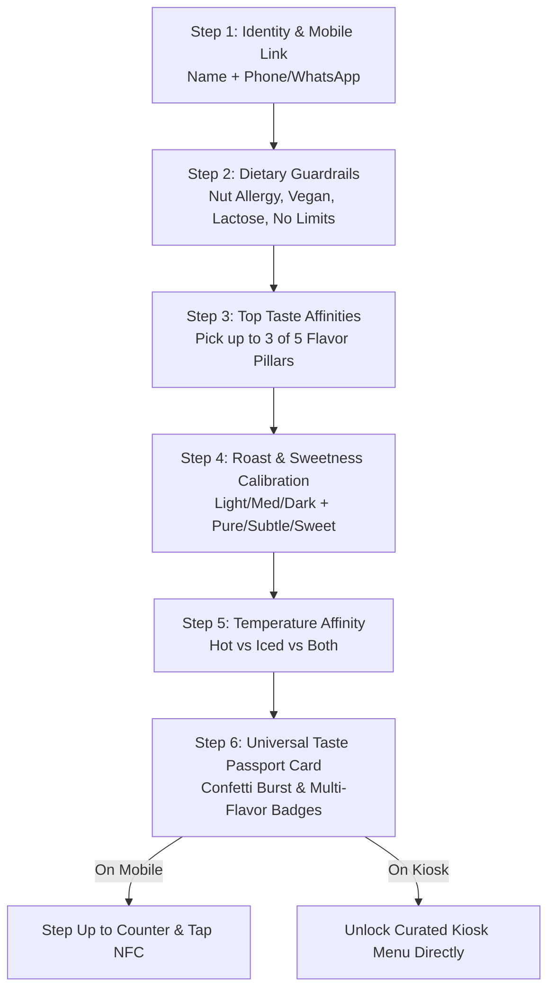

# Phase 2 Enhanced Architecture Blueprint
### Multi-Dimensional Sensory Profiling, Identity/Auth & Dual-Device Wizard Support

---

## 🎯 Upgrade Objectives

Based on deep sensory analysis and real-world specialty coffee rituals, Phase 2 is upgraded with three vital capabilities:

1. **Identity & Mobile Pass Linking**:
   - Captures **Customer Name** + **Mobile / WhatsApp Number** with regional country dial codes (`+962`, `+971`, `+961`, `+966`, `+1`).
   - Links the Universal Passport to the customer's phone for multi-cafe recognition and digital wallet support.
   - Preserves 1-tap pitch demo presets (Tariq, Salma, Areej, Noor) for investor demo agility.

2. **Multi-Dimensional Sensory Flavor Profiling**:
   - Replaces the 1D 1-10 slider with **The 5 Levantine Flavor Pillars**:
     - 🌸 **Floral & Blossom (زهري ووردي)**: Damascene Rose, Jasmine, Orange Blossom
     - 🍫 **Cacao & Earthy (كاكاو وأرضي)**: 70% Dark Cocoa, Sesame Tahini, Chios Mastic
     - 🍊 **Bright Citrus & Fruit (حمضيات وعصارية)**: Blood Orange, Cascara Cherry, Bergamot
     - 🍯 **Spiced & Golden (توابل وهيل)**: Green Cardamom, Medjool Date, Ceylon Cinnamon
     - 🥛 **Silky Velvet & Cream (حليبي مخملي)**: Oat Microfoam, Caramel Malt, Sweet Cream
   - **Multi-Taste Selection**: Customer selects **up to 3 flavor affinities** (minimum 1 recommended).
   - Premium expansion note: *"Select up to 3 favorite taste pillars. You can always refine your full flavor radar at fayrouz.coffee/passport"*.
   - **Roast & Sweetness Calibration**:
     - Roast Character: *Light & Floral Bloom* $\cdot$ *Medium & Balanced* $\cdot$ *Dark & Intense Crema*
     - Sweetness Level: *Unsweetened Pure (0%)* $\cdot$ *Subtle Natural Touch* $\cdot$ *Rich & Indulgent*

3. **Dual-Device Onboarding (Mobile OR Kiosk)**:
   - Wizard runs seamlessly inside the **iPhone 16 Pro Mobile Simulator**.
   - Wizard can ALSO be launched directly on the **iPad Pro Counter Kiosk** for first-time walk-in guests (*"New to Fayrouz? Create Your Taste Passport (30s)"*).
   - Completing on the kiosk automatically unlocks their curated menu directly on that kiosk!

---

## 🧠 Updated Step-by-Step Flow (6 Steps Total)

---

## 📦 Component & File Changes

1. **`src/context/ProfileContext.jsx`**:
   - Add `phone`, `tasteAffinities` (array of up to 3 strings), `roastPreference`, `sweetnessPreference`.
   - Update 4 pitch demo presets with complete flavor profiles.
   - Add `isKioskWizardOpen` modal state for on-kiosk onboarding.

2. **`src/utils/personalizationEngine.js`**:
   - Export `FLAVOR_PILLARS` with keywords.
   - Update `calculateMatchScore` to evaluate:
     - Flavor pillar keyword overlap with `item.tastingNotes` (+15% match bonus per hit).
     - Roast level compatibility (+10% match).
     - Sweetness level compatibility (+15% match).
     - Temperature affinity & dietary safety.

3. **`src/utils/personaGenerator.js`**:
   - Generate persona titles from flavor pillars and roast/sweetness combinations:
     - E.g. *The Damascene Botanical Explorer* / *The Heritage Cardamom Connoisseur* / *The Sweet Velvet Alchemist* / *The Single-Origin Obsidian Purist*.
   - Include phone masking in passport card (e.g. `+962 79 •••• 4567`).

4. **Wizard Steps**:
   - `NameStep.jsx`: Name + Phone input with country flag selector.
   - `DietaryStep.jsx`: Preserved tactile allergen guardrails.
   - `FlavorPillarsStep.jsx`: (New) 5 tactile cards, select up to 3, with link note to `fayrouz.coffee/passport`.
   - `RoastSweetnessStep.jsx`: (New) 3 roast cards + 3 sweetness cards.
   - `TemperatureStep.jsx`: Preserved hot vs cold cards.
   - `TasteProfileCard.jsx`: Updated luxury card rendering multi-flavor pills, roast/sweetness badges, and contextual CTA.
   - `WizardContainer.jsx`: Updated to 6 progress beads, responsive for mobile frame or kiosk modal.

5. **Kiosk Integration (`InitialStateMenu.jsx` & `KioskContainer.jsx`)**:
   - Add secondary button on neutral kiosk: *"New to Fayrouz? Create Your Taste Passport (30s)"*.
   - Launches wizard in tablet modal, immediately unlocking curated state on finish.
