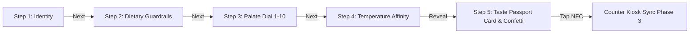

# Phase 2 Detailed Blueprint & Execution Plan
### Mobile Simulator: Sensory Onboarding Wizard & Taste Passport Card

---

## 🎯 Phase 2 Objective

Phase 2 builds the customer-facing mobile onboarding experience: the **Sensory Onboarding Wizard**. This component lives inside a high-fidelity iPhone 16 Pro chassis simulation and guides a first-time guest through a 5-step interactive journey:
1. **Identity & Levantine Hospitality** (Name & cultural greeting)
2. **Dietary & Allergen Guardrails** (Tactile multi-select chips with safety reassurances)
3. **The Sensory Palate Dial** (1–10 dynamic slider with real-time color shifting and taste notes)
4. **Temperature Affinity** (Animated steaming hot vs. chilled ice refraction cards)
5. **The Generated Taste Passport Card** (Luxury gold-foil holographic card reveal with confetti burst and NFC counter sync CTA)

At the conclusion of Phase 2, a customer or pitch audience can run the complete onboarding flow on the phone simulator, generate an authentic personalized passport, and trigger the counter handoff (`triggerNfcSync`).

---

## 🧠 Architectural & Experience Design ("Ultrathink")

### 1. iPhone 16 Pro Chassis Architecture (`WizardContainer.jsx`)

To provide realism during investor and cafe owner pitches, the wizard is housed within an authentic mobile chassis:
- **Dimensions**: Aspect ratio matching modern flagships (`max-w-[400px]`, `h-[780px]`, `rounded-[48px]`).
- **Titanium Obsidian Bezel**: Dark brushed metal perimeter border with subtle inner glow and glass reflection.
- **Dynamic Island**: Pill-shaped hardware notch displaying real-time cafe status (*"FAYROUZ ROASTERS • 09:42 AM"*), battery, and live Wi-Fi/NFC antenna icons.
- **Step Header & Progress Bar**:
  - Segmented 5-segment glowing amber bar indicating progression.
  - Smooth Back Button (`chevron-left`) with Framer Motion spring physics.
  - Step counter label: `STEP 02 OF 05`.
- **Card-Stack Sliding Transition**:
  - Bidirectional page turns using `AnimatePresence mode="wait" custom={direction}`.
  - Smooth spring physics (`stiffness: 300`, `damping: 30`) preventing layout thrashing.



---

### 2. Detailed Step-by-Step UX Breakdown

#### Step 1: Identity & Levantine Hospitality (`NameStep.jsx`)
* **Prompt**: *"What should we call you when your coffee is ready?"*
* **Cultural Greeting**: *"صباح الخير.. أهلاً وسهلاً بك في فيروز"* (Good morning.. Welcome to Fayrouz).
* **Atmospheric Polish**: Subtle floating coffee aroma particle embers in the background.
* **Input Mechanics**:
  - Tactile dark-glass text input with glowing amber focus ring.
  - Quick Suggestion Chips for pitch convenience (*"Layla"*, *"Tariq"*, *"Salma"*, *"Karim"*).
  - Quick Demo Preset Banner: *"In a hurry? Tap any persona preset to instantly fill."*
* **Validation**: Disables "Continue" button if name is empty; supports pressing `Enter` to advance.

#### Step 2: Dietary Guardrails (`DietaryStep.jsx`)
* **Prompt**: *"Any strict rules we must honor?"*
* **Subtitle**: *"We automatically adapt our recipes or flag allergens before you order."*
* **Tactile Chip Matrix**:
  - 🥛 **Lactose-Free** (*"Auto-swaps milk drinks to Oat Milk (+$0.50)"*)
  - 🌱 **100% Vegan** (*"Plant-based only; strict dairy & animal exclusion"*)
  - 🥜 **Nut Allergy** (*"Zero contamination: flags pistachio, walnut, and cashew"*)
  - ✨ **No Restrictions** (*"Free to roam our entire specialty catalog"*)
* **Mutual Exclusivity Logic**:
  - Tapping "No Restrictions" deselects all restrictions.
  - Tapping any allergen restriction deselects "No Restrictions".
* **Live Safety Reassurance Card**:
  - If Nut Allergy selected $\rightarrow$ *"⚠️ Cross-contact protocol engaged: 3 nut items will be flagged."*
  - If Vegan selected $\rightarrow$ *"🌱 Plant-based protocol: Cortados & lattes will auto-swap to Oat Milk."*

#### Step 3: The Sensory Palate Slider (`PalateStep.jsx`)
* **Prompt**: *"How do you like your brew?"*
* **Interactive 1–10 Slider**:
  - Smooth drag physics with numeric callout bubble.
  - **Zone 1 (Score 1–3)**: *Dark, Bold & Intensely Aromatic*
    - Visual: Deep dark chocolate & roasted bean ambiance (`#0c0908` dark tint).
    - Tasting cues: *Single-Origin Ristretto, Cacao Nibs, Cedar & Smoke*.
  - **Zone 2 (Score 4–7)**: *Balanced, Floral & Nuanced*
    - Visual: Golden amber pour-over bloom ambiance (`#231a15` with warm amber glow).
    - Tasting cues: *Ethiopian Bergamot, Jasmine, White Peach, Silky Crema*.
  - **Zone 3 (Score 8–10)**: *Sweet, Velvet & Comforting*
    - Visual: Creamy caramel froth ambiance (`#2a1f18` with rose-gold glow).
    - Tasting cues: *Dulce de Leche, Medjool Date Caramel, Cinnamon Dust*.
* **Dynamic Background Fluidity**: CSS radial background gradient shifts color temperature in real time as the thumb moves.

#### Step 4: Temperature Affinity (`TemperatureStep.jsx`)
* **Prompt**: *"Hot or Iced?"*
* **Subtitle**: *"Your curated shelf will strictly honor your temperature mood."*
* **Two Interactive Sensory Cards**:
  1. ☕ **Warm & Steaming (ساخن ومريح)**:
     - Animated SVG steam wisps wafting upward using Framer Motion loop keyframes.
     - Warm ember border glow (`border-fayrouz-ember/40`).
     - Microcopy: *"Extracts delicate aromatics, floral notes, and microfoamed oat milk."*
  2. 🧊 **Cold & Crisp (بارد ومنعش)**:
     - Condensation sparkle and ice cube refraction accents.
     - Crisp sky-blue border glow (`border-fayrouz-sky/40`).
     - Microcopy: *"Slow-dripped for 24 hours or flash-chilled over crystal ice."*
* **Tertiary Option**: Subtle bottom button: *"I love both equally (أي درجة حرارة)"* for all-weather drinkers.

#### Step 5: The Generated Taste Passport Card (`TasteProfileCard.jsx`)
* **The Climax Moment**:
  - Celebratory confetti explosion (`canvas-confetti`) with golden amber, copper, and rose flakes.
  - Luxury holographic card styling with burnished metallic gold rim (`fayrouz-copper`), obsidian glass background, and subtle angled shine effect.
* **Dynamic Persona Title Engine**:
  - Formula combining palate score and dietary restrictions:
    - Score 1–2: **"The Single-Origin Purist"** *(عاشق القهوة الصافية)*
    - Score 3–4: **"The Terroir Explorer"** *(مستكشف النوتات الزهرية)*
    - Score 5–6: **"The Levantine Connoisseur"** *(المتذوق المتناغم)*
    - Score 7–8: **"The Velvet Seeker"** *(الباحث عن المخملية)*
    - Score 9–10: **"The Sweet Alchemist"** *(عاشق الحلاوة والدفء)*
    - Prefix if Vegan: e.g. *"The Plant-Based Terroir Explorer"*.
* **Card Metadata Display**:
  - Customer Name & Levantine Welcome (*"مرحباً [Name]"*).
  - Passport ID hash (e.g. `#FYZ-8821`).
  - Palate Gauge: Visual 10-point segmented gold bar.
  - Active Dietary Badges (`Nut Safe`, `Oat Milk`, `Vegan`).
  - Temperature Affinity Badge (`Chilled Preferred` / `Warmth Preferred`).
  - Curated Matches Preview count: *"3 Perfect Matches Ready at Counter"*.
* **The Counter Handoff Action Button**:
  - **"Step Up to the Counter & Tap (NFC)"** with an organic breathing amber glow.
  - Triggering this button dispatches `triggerNfcSync()` in `ProfileContext`, simulating the phone beaming the passport to the tablet kiosk.

---

### 3. File Structure & Deliverables for Phase 2

```
/Users/noor/Projects/fayrouz/
├── src/
│   ├── components/
│   │   └── wizard/
│   │       ├── WizardContainer.jsx      # iPhone 16 Pro chassis, dynamic island, nav & frame
│   │       ├── NameStep.jsx             # Step 1: Hospitality, name input & presets
│   │       ├── DietaryStep.jsx          # Step 2: Multi-select allergen & dietary chips
│   │       ├── PalateStep.jsx           # Step 3: Interactive 1-10 sensory dial & morphing colors
│   │       ├── TemperatureStep.jsx      # Step 4: Steaming hot vs iced card selection
│   │       └── TasteProfileCard.jsx     # Step 5: Luxury holographic passport card & confetti
│   └── utils/
│       └── personaGenerator.js         # Persona titles and badge generator logic
└── docs/
    └── plans/
        └── PHASE_2_PLAN.md              # This architecture blueprint
```

---

## 📋 Step-by-Step Implementation Sequence

### Step 2.1: Build `src/utils/personaGenerator.js`
- Implement deterministic persona naming based on `palateScore` (1–10) and `dietary` flags.
- Generate Arabic persona titles (*"عاشق القهوة الصافية"*, *"مستكشف النوتات الزهرية"*, etc.).
- Generate simulated unique Passport serial numbers (e.g. `FYZ-9402`).

### Step 2.2: Implement Step 1 (`NameStep.jsx`)
- Input field with glowing amber focus state.
- Floating aroma visual effects and Levantine welcoming text.
- 4 quick suggestion buttons for rapid persona testing.

### Step 2.3: Implement Step 2 (`DietaryStep.jsx`)
- 4 tactile chips with spring tap feedback.
- Mutual exclusivity handler (No Restrictions vs. Specific Allergens).
- Real-time safety reassurance banner explaining what the engine will do.

### Step 2.4: Implement Step 3 (`PalateStep.jsx`)
- 1–10 interactive range slider with animated value badge.
- 3 sensory zones (Dark/Bold, Balanced/Floral, Sweet/Velvet).
- Dynamic color temperature gradient background shifting in sync with slider value.

### Step 2.5: Implement Step 4 (`TemperatureStep.jsx`)
- Framer Motion animated steam ribbons on the Hot Card.
- Ice refraction and frost shimmer on the Cold Card.
- "Any Temperature" secondary link.

### Step 2.6: Implement Step 5 (`TasteProfileCard.jsx`)
- Holographic glassmorphism passport card with copper/gold metallic rim.
- Confetti celebration burst using `canvas-confetti`.
- Pulsing **"Tap Phone at Counter (NFC)"** primary button triggering `triggerNfcSync()`.

### Step 2.7: Implement `WizardContainer.jsx` & Chassis
- iPhone 16 Pro bezel, inner glass reflection, speaker ear-piece, and dynamic island.
- Step indicator with glowing beads and back button.
- Integrate all 5 steps with directional sliding transitions.

### Step 2.8: Integrate into `App.jsx` & Verify Build
- Mount `WizardContainer` in `App.jsx` under a dedicated **"📱 Mobile Wizard Simulator"** tab or view.
- Run `npm run build` to guarantee 0 build warnings.

---

## ❓ Critical Design Decisions & Alignment (Agreed)

The following four strategic decisions have been confirmed for Phase 2:

1. **Quick Persona Shortcuts on Step 1**: **Option A Selected**
   - Step 1 (NameStep) includes 4 quick-tap persona chips (**Tariq**, **Salma**, **Areej**, **Noor**) allowing 1-click pre-fill for pitch agility.
   - Replaced "Karim" with **Areej (أريج)** — meaning "exquisite fragrant aroma", symbolizing the sweet and velvety coffee seeker.

2. **Audio & Sensory Experience**: **Option B Selected (Web Audio Synthesis)**
   - Included subtle, elegant Web Audio synthesized soundscapes (zero external asset loading): gentle tactile tap clicks, soft warm chord on passport generation, and an audio mute toggle in the top bar.

3. **Dynamic Island Behavior**: **Option A Selected (Active Status & NFC Morphing)**
   - The iPhone Dynamic Island displays live cafe status (*"FAYROUZ ROASTERS • 09:42 AM"*), morphing into an animated pulsing beam wave upon counter sync handoff.

4. **Mobile Responsiveness**: **Option A Selected (Adaptive Frame)**
   - Desktop and tablet viewports display the realistic iPhone 16 Pro chassis. When viewed on actual mobile smartphones (`<640px`), the layout expands gracefully to fit the screen natively.

---

## ✅ Phase 2 Acceptance Criteria
- [ ] Realistic iPhone 16 Pro chassis with dynamic island, smooth step transitions, and progress bar.
- [ ] Step 1 captures customer name with Levantine cultural hospitality greeting.
- [ ] Step 2 handles multi-select dietary restrictions with mutual exclusivity for "No Restrictions".
- [ ] Step 3 provides a 1–10 slider with real-time sensory zones and dynamic color background shifting.
- [ ] Step 4 offers interactive Hot vs. Iced cards with animated steam ribbons.
- [ ] Step 5 renders the holographic gold-foil Taste Passport Card with confetti burst and dynamic persona title.
- [ ] Hitting "Step Up to the Counter" triggers `triggerNfcSync()` and updates `ProfileContext`.
- [ ] Production build (`npm run build`) compiles cleanly with 0 errors.
