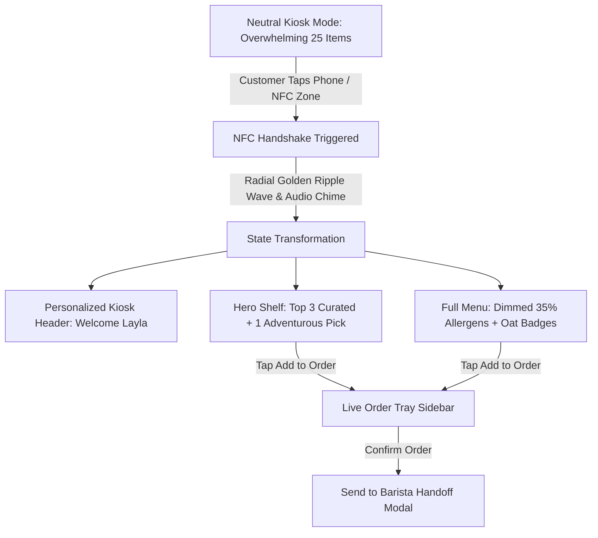

# Phase 3 Detailed Blueprint & Execution Plan
### Tablet Simulator: The Magic Dynamic Menu & NFC Sync Kiosk

---

## 🎯 Phase 3 Objective

Phase 3 builds the emotional centerpiece of the **Fayrouz (فيروز)** pitch: the **Counter Tablet Kiosk Simulator**.

In specialty coffee shops, customers are typically confronted by 25+ complex menu options, leading to 90–120 second ordering queues, cognitive fatigue, and allergen anxiety. Phase 3 proves the solution through a dramatic two-state visual transformation:
1. **Initial Neutral State (`InitialStateMenu.jsx`)**: An overwhelming, traditional cafe menu displaying 25 items across 5 categories with dense text and high cognitive load.
2. **The Magic NFC Handshake (`NfcSyncOverlay.jsx`)**: A tactile NFC reader zone. Tapping a phone triggers a golden Levantine radial ripple wave, spatial chime, and instant profile recognition.
3. **The Transformed Curated Menu (`DynamicCuratedMenu.jsx`)**:
   - Personalized welcoming greeting with guest name, Arabic calligraphy (*"صباح الخير يا ليلى"*), and Coffee Persona title.
   - **"Curated for You" Hero Shelf**: 3 top-ranked matches strictly adhering to the guest's temperature affinity and dietary safety + 1 **Adventurous Discovery Pick ("Expand Your Palate")** with its custom Levantine storytelling rationale.
   - **Allergen-Safe Catalog**: Full catalog below the shelf remains browsable, with unsafe items dimmed (35% opacity) with warning badges (`⚠️ Unsafe: Contains Nuts`), and plant-milk auto-substitutions badged (`Auto-Swapped to Oat Milk (+$0.50)`).
   - **Interactive Order Tray & Barista Handoff**: Live cart sidebar with subtotal, tax calculation, and a simulated "Send to Barista" confirmation flow.

---

## 🧠 Architectural & Visual Experience Design ("Ultrathink")

### 1. iPad Pro Hardware Chassis Architecture (`KioskContainer.jsx`)

To emulate a real counter ordering kiosk, the simulator is encased in an iPad Pro landscape frame:
- **Aspect Ratio**: Landscape 16:10 / 4:3 ratio (`w-full max-w-5xl`, `h-[680px]`, `rounded-[36px]`).
- **Bezel Craft**: Matte obsidian anodized aluminum bezel, top front-facing camera dot, subtle glass sheen reflection, and inner shadow depth.
- **Counter Kiosk Header Bar**:
  - Left: Cafe Identity (*"FAYROUZ SPECIALTY ROASTERS"*) + Arabic script (*"محمصة فيروز المختصة"*).
  - Center: Live counter status (*"Kiosk 01 • Counter Active • 09:42 AM"*).
  - Right:
    - Audio toggle (*"Fayrouziyat Ambient Sound"*)
    - Active Guest Badge / Unsync button (*"Layla Synced"* or *"Tap to Sync"*)
    - View Switcher / Quick Presets trigger



---

### 2. Detailed Component Specifications

#### A. Initial State Menu (`InitialStateMenu.jsx`)
* **Purpose**: Establish the baseline "pain point" of traditional specialty ordering.
* **Layout**: Standard dense multi-tab catalog displaying all 25 items across categories (*Espresso*, *Velvet*, *Cold Brew*, *Levantine*, *Tea*).
* **High-Contrast Callout**: A prominent, pulsing **"NFC Passport Reader Zone"** on the top right inviting customers to tap their phone:
  - Text: *"Have a Fayrouz Passport? Tap phone here to reveal your curated menu."*
  - Animated pulsing concentric rings and NFC antenna icon.

#### B. The NFC Reader & Golden Ripple Wave (`NfcSyncOverlay.jsx`)
* **Triggering Mechanism**:
  - Clicking the on-kiosk NFC target zone.
  - OR tapping "Step Up to Counter & Tap (NFC)" on the mobile phone wizard (dispatches `triggerNfcSync()` from `ProfileContext`).
* **The Ripple Animation**:
  - Originates from the NFC antenna icon and expands outward across the entire 5xl screen using Framer Motion keyframes.
  - Two staggered expanding circles of golden amber (`#d4a373`) and gold (`#e9c46a`) with blur and opacity decay.
  - Concurrently plays high-frequency dual-tone chime (`soundFx.playNfcBeam()`).
* **Duration**: 1.1 seconds before dissolving into the personalized menu.

#### C. Dynamic Curated Menu (`DynamicCuratedMenu.jsx`)
* **Personalized Header Section**:
  - Welcoming Greeting: *"صباح الخير يا [Name] — Welcome, [Name]"*.
  - Persona Badge: e.g. `The Velvet Seeker` / `الباحث عن المخملية`.
  - Dietary Pill: e.g. `Oat Milk Swapped • Nut Safe Protocol`.
  - Temperature Affinity Pill: e.g. `Chilled Preferred`.
* **The "Curated For You" Hero Shelf**:
  - Horizontal grid of 4 cards:
    - **Top 3 Perfect Matches**: Ranked #1, #2, #3, with match % badges (`98% Match`, `94% Match`, `91% Match`).
    - **1 Adventurous Discovery Pick ("Expand Your Palate")**: Highlighted with a burnished rose-gold metallic border (`fayrouz-rose`), subtle sparkle animation, and a storytelling quote banner (*"Why You'll Love This: ..."*).
  - Quick "Add to Order (+)" button on each card with instant spring physics.
* **Full Catalog Browser Below Hero**:
  - Category tabs for quick filtering (*All*, *Espresso & Black*, *Velvet & Milk*, *Cold Brew*, *Levantine*, *Tea*).
  - Search input for real-time item filtering.
  - **Allergen Safeguards (Option A)**: Unsafe items (e.g. Pistachio latte for nut allergy) are displayed at 35% opacity, struck-through title, with an amber-red badge `⚠️ Unsafe: Contains Aleppo Pistachio`, and disabled tap.
  - **Adapted Items**: Display `Auto-Swapped to Oat Milk (+$0.50)` with updated price ($6.25).
  - **Temperature Notices**: Exclusively hot drinks display `Hot Only` tag when iced preference is active.

#### D. Live Order Tray Sidebar (`OrderTraySidebar.jsx`)
* **Placement**: Persistent 280px-wide glass sidebar on the right side of the tablet.
* **Features**:
  - Displays selected drinks with quantity counters (`+`, `-`, `trash`).
  - Lists customized options (e.g., *Oat Milk substitution*, *Iced/Hot*).
  - Financial Summary: Subtotal, Local Specialty Tax (8%), and Total.
  - Primary CTA: **"Send Order to Barista"** with a warm amber glow.
  - Confirmation Modal: Animated coffee cup drawing, order ticket # (e.g. `#FYZ-42`), estimated prep time (*"Ready in 3 mins"*), and an automatic or manual kiosk reset option.

---

### 3. File Structure & Deliverables for Phase 3

```
/Users/noor/Projects/fayrouz/
├── src/
│   ├── components/
│   │   └── kiosk/
│   │       ├── KioskContainer.jsx         # iPad Pro bezel, header, state switcher, & layout
│   │       ├── InitialStateMenu.jsx       # Neutral traditional menu with NFC reader prompt
│   │       ├── NfcSyncOverlay.jsx         # Golden radial ripple wave & sync animation
│   │       ├── DynamicCuratedMenu.jsx     # Curated hero shelf + full categorized catalog
│   │       ├── KioskItemCard.jsx          # Specialty item card with allergens & add-to-tray
│   │       └── OrderTraySidebar.jsx       # Live order tray, pricing tally, & barista modal
│   └── utils/
│       └── kioskHelpers.js                # Tax calculations, order numbering, & formatting
└── docs/
    └── plans/
        └── PHASE_3_PLAN.md                # This comprehensive architecture document
```

---

## 📋 Step-by-Step Implementation Sequence

### Step 3.1: Build `src/utils/kioskHelpers.js`
- Order number generator (`FYZ-042`).
- Financial calculation utilities (subtotal, 8% tax, total formatting).

### Step 3.2: Build `KioskItemCard.jsx`
- Renders item title in English and Arabic, price, sensory pills, and roast indicators.
- Handles three visual states:
  - Normal Safe item.
  - Adapted item with `Auto-Swapped to Oat Milk (+$0.50)`.
  - Dimmed 35% opacity item with `⚠️ Unsafe: Contains [Allergen]` and disabled add button.
- Smooth Framer Motion spring physics on tap.

### Step 3.3: Build `InitialStateMenu.jsx`
- Dense 25-item catalog simulating the traditional uncurated ordering experience.
- Prominent glowing NFC Reader Zone inviting customer passport tap.

### Step 3.4: Build `NfcSyncOverlay.jsx`
- Concentric expanding golden ripple wave animation across the iPad display.
- Audio trigger via `soundFx.playNfcBeam()`.

### Step 3.5: Build `OrderTraySidebar.jsx`
- Cart tray bound directly to `orderTray` in `ProfileContext`.
- Quantity increment, decrement, and item removal.
- "Send Order to Barista" modal with celebratory badge.

### Step 3.6: Build `DynamicCuratedMenu.jsx`
- Personalized greeting header with Levantine cultural Arabic calligraphy.
- Top Hero Shelf featuring 3 best matches + 1 Adventurous Discovery Pick with quote rationale.
- Categorized menu below with real-time category filtering and search input.

### Step 3.7: Build `KioskContainer.jsx` & Hardware Shell
- Landscape iPad Pro chassis with camera dot, inner glass reflection, and aluminum bezel.
- Top kiosk header bar with live clock, status, audio toggle, and "Unsync / New Customer" button.
- Smooth transition between Neutral Mode $\leftrightarrow$ NFC Sync $\leftrightarrow$ Personalized Mode.

### Step 3.8: Integrate into `App.jsx` & Verify Build
- Add **"📟 Tablet Kiosk Simulator"** tab in `App.jsx`.
- Verify seamless cross-component synchronization: changing profile on Mobile or Playground instantly updates Kiosk state.
- Run `npm run build` to confirm 0 compilation errors.

---

## ❓ Critical Design Decisions & Alignment (Agreed)

The following four strategic decisions have been confirmed for Phase 3:

1. **Order Tray Layout**: **Option A Selected (Persistent Right Sidebar)**
   - The iPad Pro simulator features a persistent ~280px-wide glass sidebar on the right displaying real-time order items, quantity controls, subtotal, 8% tax, and the primary "Send Order to Barista" CTA.

2. **Barista Order Completion Flow**: **Option A Selected (Manual Controlled Reset)**
   - Completing an order renders a celebratory receipt modal (*"Order #FYZ-042 sent to Barista Noor • Ready in 3 mins"*), with a manual **"Start New Guest Order"** button so the presenter controls the pacing during pitches.

3. **Live Multi-Device Synchronization**: **Option A Selected (Live Real-Time Morphing)**
   - When synced, the kiosk is dynamically reactive: adjustments made on the Mobile Wizard (e.g. moving the palate slider from 1 to 9 or toggling nut allergy) instantly morph and re-rank the kiosk's curated cards in real time with 60fps Framer Motion layout transitions.

4. **Ambient Audio Atmosphere**: **Option A Selected (Warm Acoustic Ambient Soundscape)**
   - The kiosk header includes a dedicated ambient sound toggle that generates a soothing, warm Levantine coffee shop acoustic arpeggio using Web Audio API synthesis, pairing beautifully with Fayrouziyat hospitality.

---

## ✅ Phase 3 Acceptance Criteria
- [ ] Landscape iPad Pro hardware chassis with aluminum bezel, camera dot, and glass sheen.
- [ ] Initial State Menu accurately conveys the high cognitive load of traditional 25-item ordering.
- [ ] NFC Reader Zone triggers expanding golden radial ripple wave and audio chime.
- [ ] Transformed menu renders personalized Arabic/English greeting, Coffee Persona title, and safety badges.
- [ ] Hero shelf renders 3 top matches + 1 Adventurous Discovery Pick with bespoke storytelling rationale.
- [ ] Unsafe allergen drinks are displayed dimmed (35% opacity) with clear warning badges and disabled tap.
- [ ] Adapted drinks display `Auto-Swapped to Oat Milk (+$0.50)` with updated pricing.
- [ ] Live order tray tracks selected items, calculates subtotal & tax, and executes barista submission modal.
- [ ] Unsync / Reset button cleanly returns kiosk to Neutral State.
- [ ] `npm run build` compiles cleanly with 0 errors.
