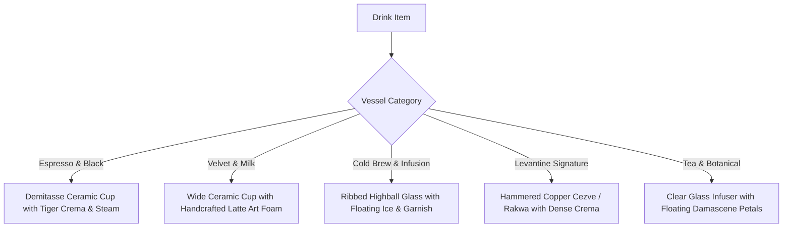

# Phase 3 Visual Optimization & Craft Blueprint
### Sensory Beverage Vectors, Spacious Kiosk Layout & Responsive Elevation

> *"People eat and drink with their eyes first."* — In luxury specialty coffee, ordering is a tactile, visual, and aesthetic pleasure. This plan overhauls Phase 3 from text-heavy data cards into a rich, comfortable, visual-first kiosk experience.

---

## 🎯 Objectives & Problem Statement

### Identified Issues
1. **NFC Banner Overflow**: The text *"Have a Fayrouz Passport? Tap Phone Here"* in `InitialStateMenu.jsx` gets truncated or squished because two large action buttons occupy ~360px on the right inside the tablet's ~700px main viewport.
2. **Cramped 3-Column Card Layout**: Squeezing 3 cards into ~700px forces each card into a tight ~210px box, crowding text lines and giving a claustrophobic feel.
3. **Text-Only Sensory Disconnect**: Specialty drinks (e.g. *Damascus Rose Cortado*, *Cold Brew Tonic*, *Traditional Rakwa*, *Aleppo Pistachio Latte*) are presented strictly as text paragraphs without visual drink representations.

### Target Vision
- **Spacious 2-Column Grid**: Generous breathing room, comfortable typography, and larger touch targets.
- **Dynamic Beverage Craft Vectors (`DrinkArtwork.jsx`)**: Bespoke visual illustrations for all 25 drinks displaying cup vessels, latte art, liquid gradients, ice cubes, steam, and Levantine botanicals.
- **Responsive, Unclipped Kiosk Banner**: Clean dual-action architecture that adapts smoothly across viewport sizes without horizontal clipping.

---

## ☕ Visual Vessel Design System (`DrinkArtwork.jsx`)

Each of the 25 menu items will map to one of **5 distinct handcrafted visual vessels** rendered via SVG & Tailwind gradients:



### 1. Demitasse Ceramic Cup (Espresso & Black)
* **Vessel**: Thick-walled matte ceramic cup in dark obsidian or terracotta.
* **Liquid**: Deep espresso with a rich, marbeled golden-amber crema ring.
* **Physics**: Dual animated steam wisps rising subtly above the rim (`framer-motion`).

### 2. Wide Artisan Cup (Velvet & Milk)
* **Vessel**: Low, wide stoneware cup with ergonomic handle.
* **Liquid**: Silky microfoam surface featuring vector **Latte Art**:
  * *Tulip / Rosetta* for Cortados and Flat Whites.
  * *Pistachio Green Swirl* for Aleppo Pistachio Latte.
  * *Cardamom dusting / Honey spiral* for Vanilla Cardamom Miel.

### 3. Ribbed Tall Highball Glass (Cold Brew & Iced Drinks)
* **Vessel**: Elegant fluted glass with condensation highlights.
* **Liquid**: Ombre gradient (dark cold brew at the bottom fading to amber, or luminous ruby cascara).
* **Details**:
  * Floating translucent 3D-angled ice cubes with frosted corners.
  * Fresh garnish: Dehydrated blood orange wheel, green mint sprig, or cascara berry.

### 4. Hammered Copper Cezve / Rakwa (Levantine Signature)
* **Vessel**: Authentic Middle Eastern cezve with flared pouring lip and long engraved brass handle.
* **Liquid**: Dark, unctuous simmering coffee with thick golden *wajh* (crema head).
* **Accents**: Cracked green cardamom pod resting at the base and warm ember glow.

### 5. Clear Glass Botanical Teapot (Tea & Botanical)
* **Vessel**: Modern spherical laboratory glass with optical clarity.
* **Liquid**: Translucent jewel tones (Rose blush, Sage amber, Jasmine gold).
* **Accents**: Floating Damascene rosebuds, loose mountain sage leaves, and herbal steam.

---

## 📐 Spatial Layout & Card Architecture

### A. Redesigned Kiosk Item Card (`KioskItemCard.jsx`)
Instead of a stacked vertical box, each card adopts a **horizontal split layout**:

```
+--------------------------------------------------------------------+
| [DRINK ARTWORK (40%)]      | [DETAILS & ACTIONS (60%)]              |
|                            |                                        |
|  +----------------------+  |  Light Roast • High Altitude           |
|  |                      |  |  Damascus Rose Cortado                 |
|  |   [LATTE ART CUP]    |  |  كورتادو الورد الشامي                  |
|  |     with steam       |  |  Micro-distilled rosewater, oat milk   |
|  |                      |  |  -----------------------------------   |
|  +----------------------+  |  $5.75              [ + Add to Order ] |
|  [98% Match] [Hot/Chilled] |                                        |
+--------------------------------------------------------------------+
```

- **Dimensions**: Generous `min-h-[190px]` with `p-4.5`.
- **Card Grid**: Switch from `grid-cols-3` to `grid-cols-2` (on tablet landscape) and `grid-cols-1` (on mobile).
- **Allergen Dimming**: Unsafe cards remain dimmed (35% opacity) with a frosted red security shield badge over the artwork.

### B. Responsive NFC Invitation Banner (`InitialStateMenu.jsx`)
- **Structure**: Stacked or 2-column flex layout with dedicated zones:
  - **Zone 1 (Identity)**: Glowing NFC target beacon + Heading *"Have a Fayrouz Passport?"* + Arabic invitation.
  - **Zone 2 (Action Bar)**:
    - Primary Button: *"Tap Phone Here (NFC)"* with pulsing animated wave.
    - Secondary Pill: *"New Guest? Create Passport (30s)"* with gold sparkle icon.
  - Guarantee zero text clipping by avoiding hardcoded flex-shrink constraints.

---

## 🛠 File Changes & Deliverables

| File | Type | Changes |
| :--- | :--- | :--- |
| `src/components/kiosk/DrinkArtwork.jsx` | **NEW** | SVG & CSS vector visualizer mapping each drink ID to vessel, liquid color, garnish, and animation |
| `src/components/kiosk/KioskItemCard.jsx` | **EDIT** | Redesigned 2-column card with artwork container, larger typography, and refined tap physics |
| `src/components/kiosk/InitialStateMenu.jsx` | **EDIT** | Responsive banner layout (no text truncation) + 2-column spacious grid |
| `src/components/kiosk/DynamicCuratedMenu.jsx`| **EDIT** | 2-column curated layout, expanded hero cards with prominent drink artwork |
| `src/data/menuData.json` | **EDIT** | (Optional) Add `vesselType` and `liquidColor` attributes if needed for dynamic rendering |
| `src/utils/personalizationEngine.test.js`| **VERIFY** | Ensure all 30 tests pass after data enhancements |

---

## 📋 Execution Roadmap

- [ ] **Step 1**: Build `src/components/kiosk/DrinkArtwork.jsx` with 5 vessel templates (Demitasse, Latte Art Cup, Tall Iced Tumbler, Copper Rakwa, Glass Pot) + liquid gradients and garnish details.
- [ ] **Step 2**: Redesign `KioskItemCard.jsx` with the spacious horizontal split layout and integrate `DrinkArtwork`.
- [ ] **Step 3**: Fix the NFC banner overflow in `InitialStateMenu.jsx` and switch catalog grid to 2 comfortable columns.
- [ ] **Step 4**: Update `DynamicCuratedMenu.jsx` to render spacious hero showcase cards and a 2-column catalog.
- [ ] **Step 5**: Verify responsiveness, run test suite (`30/30 passed`), test production build (`npm run build`), and push to GitHub.
