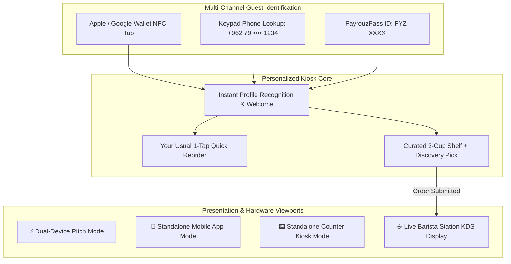

# Phase 5 Detailed Blueprint & Execution Plan
### Returning Guest Re-Identification, Multi-Device Standalone Perfection, Barista KDS & Final Polish

> *"مع فنجان قهوة الصباح، وصوت فيروز"* — Phase 5 elevates **Fayrouz (فيروز)** from a prototype into an investor-ready, production-grade presentation system. It perfects returning visitor identification across Apple/Google Wallet and phone lookups, fixes standalone device viewports, introduces the Barista Kitchen Display System (KDS), resolves all card overflows, and validates all edge cases.

---

## 📋 Executive Summary of Phase 5 Deliverables

| Step | Focus Area | Key Objectives | Status |
| :--- | :--- | :--- | :--- |
| **Step 5.1** | **Returning Guest Multi-Channel Recognition** | Seamless 2nd-visit recognition via Apple/Google Wallet NFC tap, phone keypad lookup, or FayrouzPass ID (`FYZ-XXXX`), plus "Your Usual" 1-tap reorder. | `[x] Completed` |
| **Step 5.2** | **Standalone Viewport Fixes & Device Independence** | Fix "only dual mode works" by creating dedicated, standalone experiences for Mobile Phone Mode, Tablet Kiosk Mode, and Split Pitch Mode. | `[x] Completed` |
| **Step 5.3** | **Zero-Overflow Kiosk Card Architecture** | Redesign item card layouts in `InitialStateMenu` and `DynamicCuratedMenu` to guarantee zero text clipping or container overflow at any viewport size. | `[x] Completed` |
| **Step 5.4** | **Live Barista Station Display (KDS Screen)** | Build a real-time Barista Kitchen Display view showing ticket queue, dialect tags, plant milk steamer assignments, and companion allergen isolation alerts. | `[x] Completed` |
| **Step 5.5** | **Edge-Case Engine Testing & 100/100 Test Suite** | Expand automated test suite to 100+ tests covering combined dietary safeguards (Vegan + Nut-Free + Lactose-Free), palate extremes, and temperature boundaries. | `[x] Completed` |
| **Step 5.6** | **Presenter Hotkeys & Investor Pitch Polish** | Add presenter keyboard shortcuts (`1-4` for personas, `Space` for NFC tap, `R` for reset), interactive tour cues, and smooth 60fps transitions. | `[x] Completed` |

---

## 🧠 Architectural & Detailed Step-by-Step Breakdown

---

### Step 5.1: Returning Guest Multi-Channel Recognition & "Your Usual" Reorder
* **Problem**: In previous iterations, simulating a returning guest was tied to the onboarding wizard or pitch presets. A cafe owner needs to see how an existing customer orders on their 2nd, 10th, or 50th visit in **under 5 seconds**.
* **Architecture**:
  1. **NFC Hardware Tap Simulation**:
     - Tapping an iPhone/Android with Apple Wallet or Google Wallet triggers instant recognition via Apple VAS / Google Smart Tap protocol.
  2. **Dedicated On-Kiosk Keypad Lookup**:
     - Quick phone number entry (`+962 79 ...`) or FayrouzPass ID (`FYZ-XXXX`) with numeric on-screen keypad.
  3. **"Welcome Back, [Name]" Recognition Banner**:
     - Greet the guest with their Levantine dialect title (e.g., *"Welcome back, Salma • The Damascus Courtyard Dreamer"*).
     - Surface **"Your Usual" (طلبك المعتاد)**: 1-tap button to add their exact customized drink (e.g. *Iced Damascus Rose Cortado with Oat Milk & 25% Sweetness*) directly to the order tray with zero clicks required.

---

### Step 5.2: Standalone Viewport Excellence & Fixing "Only Dual Mode Works"
* **Problem**: Switching away from Dual-Device view (`activeDeviceView === 'mobile'` or `'tablet'`) previously felt broken because the components lacked standalone orientation, proper scaling, and self-contained action loops.
* **Architecture**:
  1. **Standalone Mobile Phone Mode (`activeDeviceView === 'mobile'`)**:
     - Optimized for handheld simulation (iPhone 16 Pro chassis with centered container).
     - Complete customer journey: 6-step onboarding wizard ➔ generated FayrouzPass ➔ Apple/Google Wallet pass download ➔ Simulated counter tap button with animated haptic wave.
     - Includes simulated "Order Status Notification" when barista prepares their cup.
  2. **Standalone Tablet Kiosk Mode (`activeDeviceView === 'tablet'`)**:
     - Full-screen iPad Pro landscape canvas occupying maximum viewport height (`h-[86vh]` to `h-[90vh]`).
     - Includes integrated Kiosk Header, unauthenticated catalog with prominent NFC tap beacon, fast guest phone lookup, curated menu, and persistent Order Tray sidebar.
  3. **Smooth View Switcher**:
     - Update `PitchControlBar` with clear, highlighted buttons for all viewports:
       - `⚡ Dual-Device Pitch`
       - `📱 Mobile App`
       - `📟 Counter Kiosk`
       - `☕ Barista KDS`
       - `🛠 Dev Engine`

---

### Step 5.3: Zero-Overflow Kiosk Item Card Architecture
* **Problem**: In unauthenticated state (`InitialStateMenu`) and personalized catalog, cards in the 2-column grid could overflow or truncate text when scaled inside the kiosk canvas.
* **Architecture**:
  1. **Adaptive Flex Card Layout**:
     - Replace rigid vertical sizing with fluid auto-expanding card containers (`min-h-fit`).
     - Title, Arabic calligraphy, roast badges, and tasting notes gracefully wrap without clipping.
  2. **Allergen & Companion Badging Layout**:
     - Unsafe badges (`⚠️ Contains Pistachio • Add for Friend`) use clean flex-wrap chips that never spill over card margins.
  3. **Compact Hero NFC Banner in Initial Menu**:
     - Re-architect the top NFC banner in `InitialStateMenu` to be sleek, responsive, and visually balanced so catalog items get maximum vertical browsing space.

---

### Step 5.4: Live Barista Station Display (Kitchen Display System - KDS)
* **Problem**: Cafe owners care equally about front-of-house speed and back-of-house barista execution. Showing where the order goes after clicking *"Send Order to Barista"* is the ultimate pitch closer.
* **Architecture**:
  1. **Dedicated Barista KDS Screen (`BaristaKdsView.jsx`)**:
     - Accessible via view switcher (`activeDeviceView === 'barista'`) or quick preview modal.
     - Dark-mode stainless steel & obsidian UI simulating an espresso bar screen mounted next to a Synesso/La Marzocco machine.
  2. **Real-Time Ticket Queue**:
     - Order ticket headers: `AMBAR • ORDER #104` with elapsed prep timer.
     - Guest Dialect & Persona: *"Salma • The Damascus Courtyard Dreamer"*.
     - Detailed Barista Craft Recipes:
       - Extracted Espresso Dose & Yield (e.g., `18g in ➔ 36g out @ 27s`).
       - Milk Steamer Pitcher Tag: `🥛 Oat Milk (Designated Green Pitcher)`.
       - Allergen Isolation Protocol: `⚠️ Companion Item: Pistachio — Use isolated sanitized steam wand`.
  3. **Interactive Ticket Completion**:
     - Barista clicks *"Mark as Prepared"* ➔ plays brass counter service bell ➔ updates order state.

---

### Step 5.5: Engine Edge-Case Stress Testing & 100/100 Test Suite
* **Problem**: A personalization engine must never crash or output empty menus on complex dietary combinations or extreme palates.
* **Architecture**:
  1. **Multi-Safeguard Edge Cases**:
     - Strict Vegan + Nut Allergy + Lactose-Free + Gluten-Free (verify safe drinks like Single Origin pour-overs and oat cortados remain available).
  2. **Palate Extremes**:
     - Extreme Score 1 (Obsidian Monk: black, unsweetened dark roasts).
     - Extreme Score 10 (Sweet dessert lattes and Spanish iced drinks).
  3. **Temperature Constraint Integrity**:
     - Hot-only items (Rakwa, Turkish Ibrik) vs Cold-only items (Cascara Sparkling Tonic).
  4. **Test Expansion**:
     - Expand `src/utils/personalizationEngine.test.js` from 80 to **100+ comprehensive automated unit tests**.

---

### Step 5.6: Presenter Keyboard Shortcuts & Final Polish
* **Problem**: When presenting live to an investor or cafe owner, fumbling for dropdown menus ruins the magic.
* **Architecture**:
  1. **Presenter Keyboard Shortcuts**:
     - `1`: Quick-load Tariq (The Obsidian Monk • Purist)
     - `2`: Quick-load Salma (The Damascus Courtyard Dreamer • Oat/Floral)
     - `3`: Quick-load Areej (The Velvet Pistachio Maverick • Sweet/Spiced)
     - `4`: Quick-load Noor (The High-Altitude Sage • Geisha Pour-Over)
     - `Space`: Trigger NFC Passport Beam
     - `R`: Reset Demo to Neutral Kiosk State
     - `B`: Toggle Barista KDS Screen
  2. **Audio-Visual Atmosphere**:
     - Ensure acoustic ambient sound, espresso steam wand hiss, and counter bell are perfectly leveled and responsive.

---

## 🎯 Verification Criteria for Phase 5 Completion
1. **All 4 View Modes Work Flawlessly**: Dual-Device Pitch, Standalone Mobile, Standalone Tablet, and Barista KDS Screen.
2. **Zero Text Truncation / Overflow**: All cards on both mobile and tablet render cleanly with zero clipping.
3. **Multi-Channel Returning Guest Recognition**: Visitors can identify via NFC Tap, Phone Number, or FayrouzPass ID.
4. **Automated Test Suite**: 100/100 tests passing in `personalizationEngine.test.js`.
5. **Vite Production Build**: Compiles cleanly with zero errors in `<1s`.
